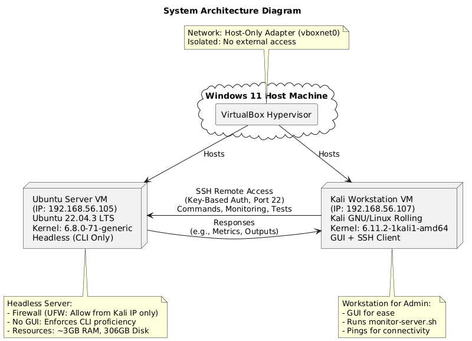
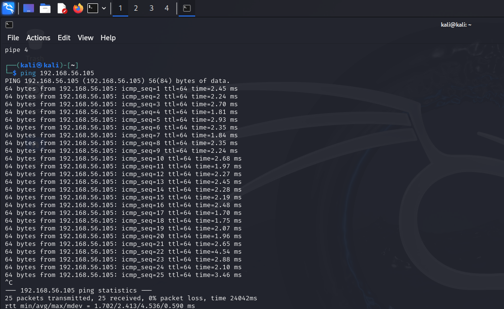
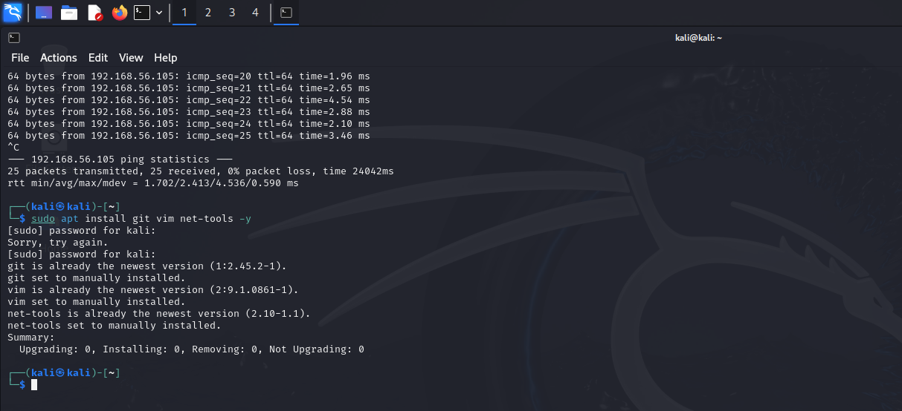
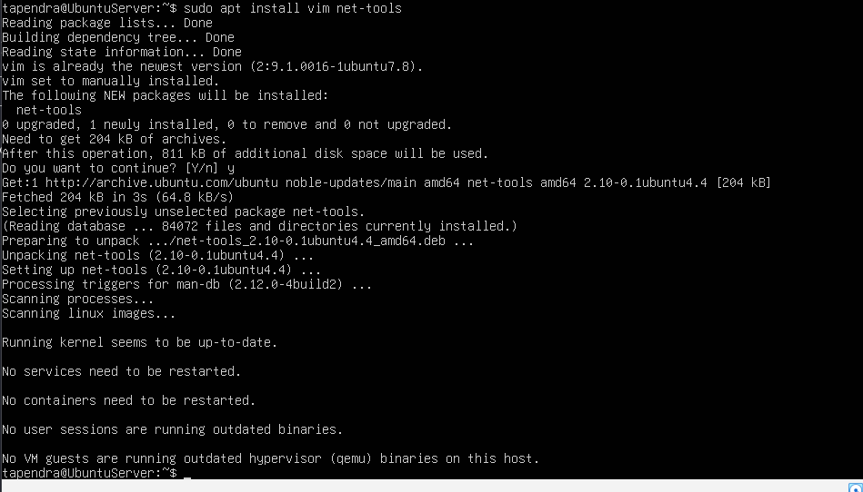
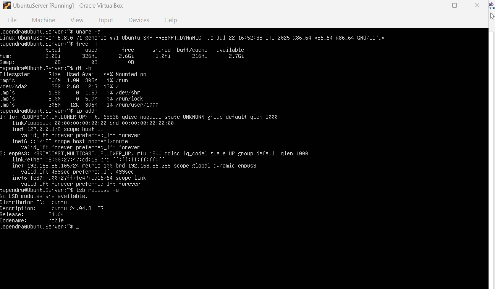
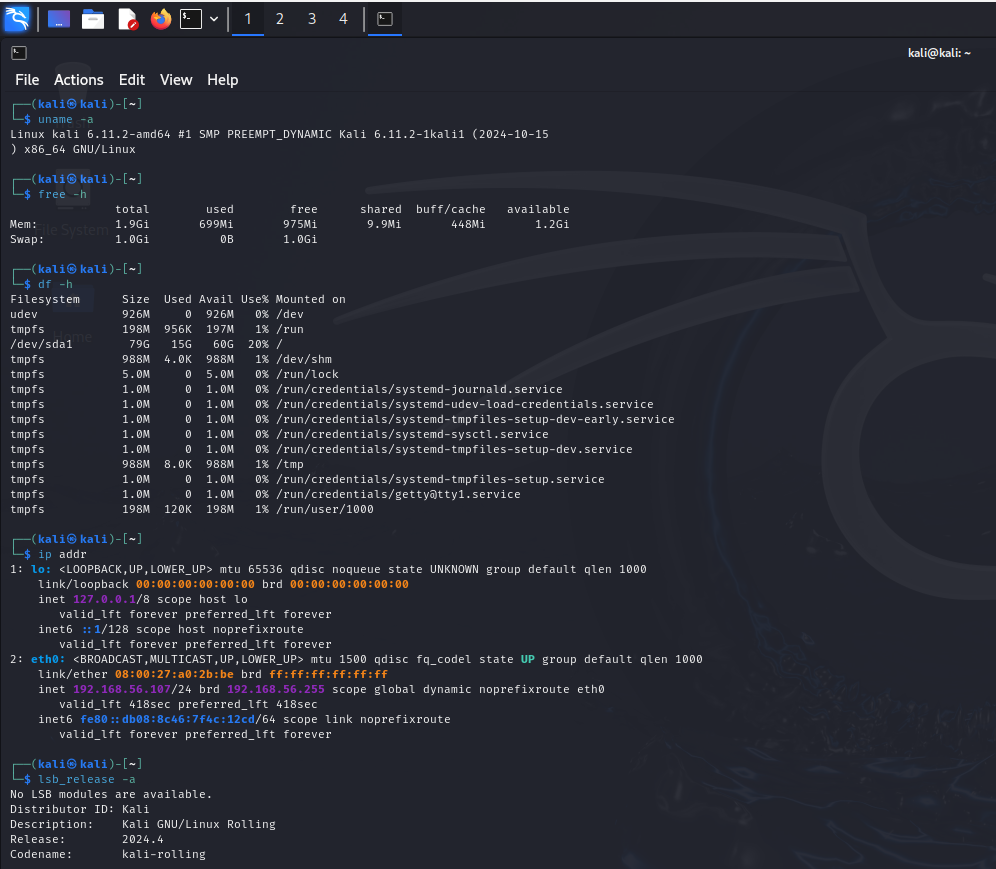

# Week 1: System Planning and Distribution Selection

## System Architecture Diagram

## Distribution Selection Justification
I chose Ubuntu Server 22.04.3 LTS (from lsb_release output) over alternatives like Debian because Ubuntu has better community support, frequent updates, and easier package management for beginners.

## Workstation Configuration Decision

I chose Kali Linux VM (Option A) as workstation because it has a GUI, built-in SSH client, and tools for security testing, justifying remote admin needs.

## Network Configuration Documentation

Using VirtualBox host-only adapter (vboxnet0). IPs: Kali 192.168.56.107, Server 192.168.56.105. Ping test shows 0% loss, confirming connectivity.

### Environment setup in Kali Linux 

### Environment setup in Ubuntu Server

## System Specifications (CLI)
### Ubuntu Server

- Kernel: 6.8.0-71-generic (uname -a)
- Memory: 3.0GiB total (free -h)
- Disk: 306 MB total, 1.0 MB used (df -h)

### Kali Workstation

- Kernel: 6.11.2-1kali1-amd64
- Memory: Similar low usage
- Disk: As shown

**Reflection:** Setting up confirmed hardware constraints; learned VirtualBox networking.

