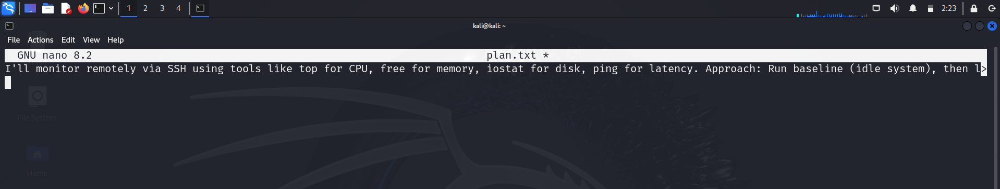
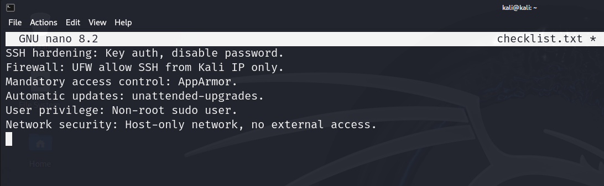
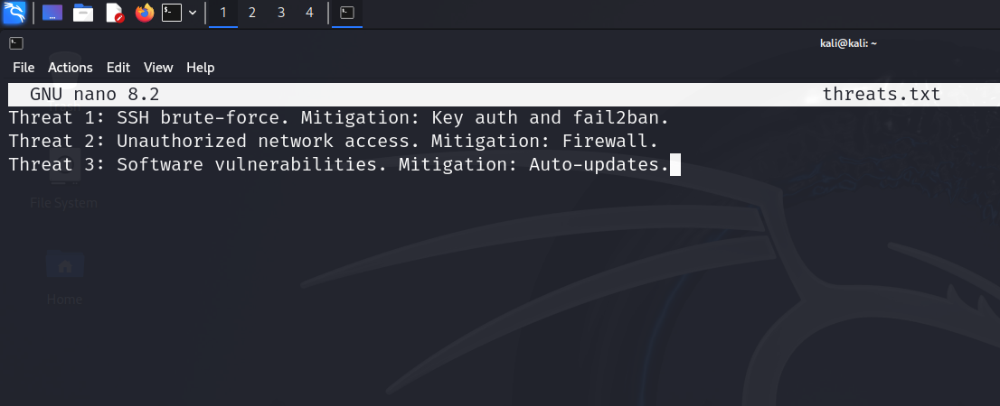

# Week 2: Security Planning and Testing Methodology

## Performance Testing Plan
I planned to monitor the system remotely via SSH using tools like top for CPU, free for memory, iostat for disk I/O, and ping for latency/diagnostics. The approach involves baseline (idle) measurements vs. load testing to quantify performance.

## Security Configuration Checklist
- SSH hardening: Key auth, disable password.
- Firewall: UFW allow from Kali IP only.
- Mandatory access control: AppArmor.
- Automatic updates: unattended-upgrades.
- User privilege: Non-root sudo user.
- Network security: Host-only network, no external access.

## Threat Model
- Threat 1: SSH brute-force. Mitigation: Key auth and fail2ban.
- Threat 2: Unauthorized network access. Mitigation: Firewall.
- Threat 3: Software vulnerabilities. Mitigation: Auto-updates.

**Reflection:** This planning addresses LO3 by identifying vulnerabilities and mitigations, and LO5 by considering performance trade-offs (e.g., security layers may add latency). Challenges: Balancing detail without overcomplicating.