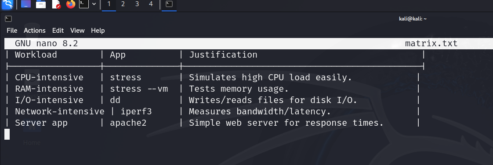
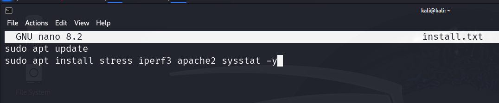
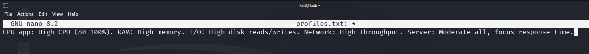
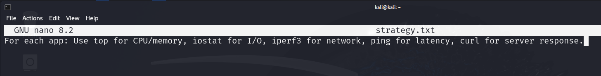

# Week 3: Application Selection for Performance Testing

## Application Selection Matrix
| Workload          | App         | Justification                          |
|-------------------|-------------|----------------------------------------|
| CPU-Intensive     | stress      | Simulates high CPU load easily.        |
| RAM-Intensive     | stress --vm | Tests memory usage.                    |
| I/O-Intensive     | dd          | Writes/reads files for disk I/O.       |
| Network-Intensive | iperf3      | Measures bandwidth/latency.            |
| Server App        | apache2     | Simple web server for response times.  |

## Installation Documentation
Commands for SSH-based installation on server:
sudo apt install stress iperf3 apache2 sysstat -y

## Expected Resource Profiles
- CPU: High (80-100%).
- RAM: High memory.
- I/O: High read/write.
- Network: High throughput.
- Server: Moderate all, focus response time.

## Monitoring Strategy
For each app: Use top for CPU/memory, iostat for I/O, iperf3 for network, ping for latency, curl for server response.

**Reflection:** Selected apps align with LO4 for CLI usage and LO5 for evaluating workloads. Trade-off: Simple apps ease testing but may not simulate real-world complexity. Learned about some resource-specific tools.
