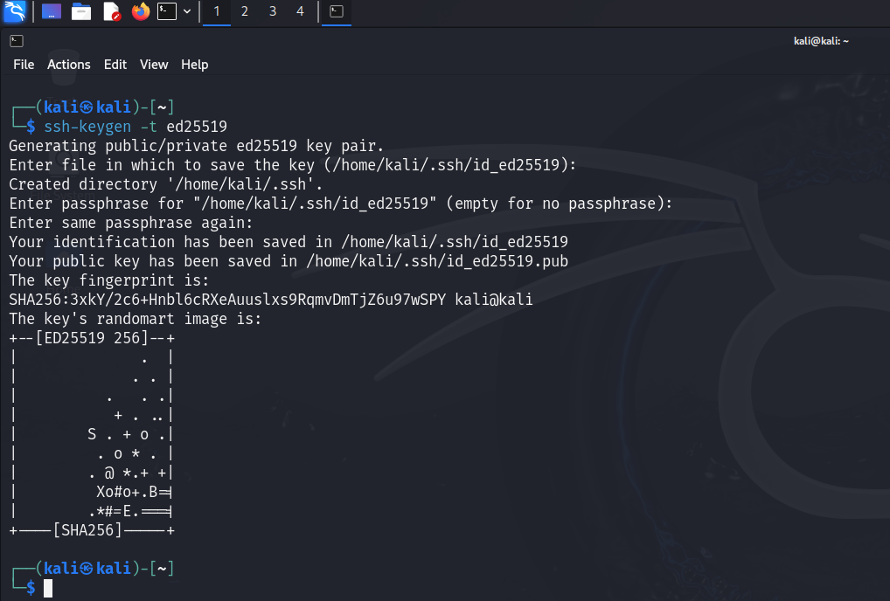
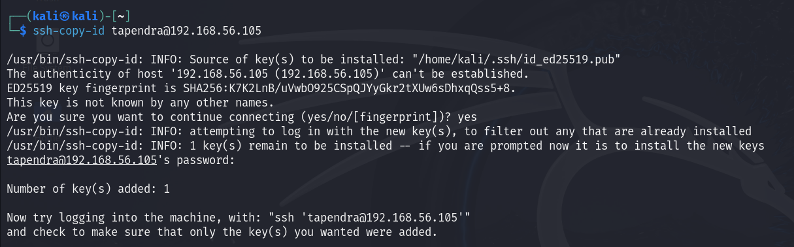
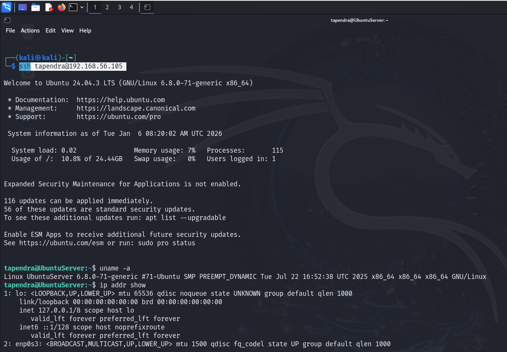
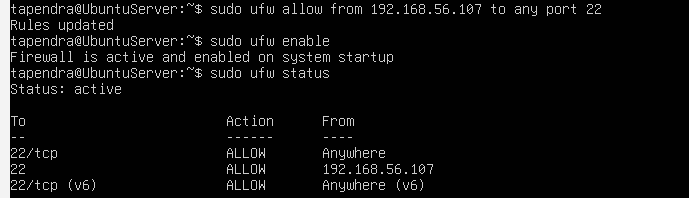
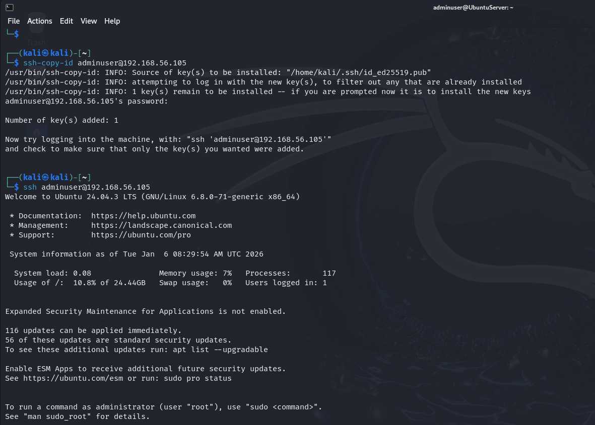

# Week 4: Initial System Configuration & Security Implementation

## SSH Key-Based Authentication
Generated keys on Kali and copied to server (192.168.56.105). Edited /etc/ssh/sshd_config to disable password auth. Successful connection without password.

## Firewall Configuration
Installed UFW, allowed SSH from Kali IP (192.168.56.107), enabled, and checked status (shows ruleset limiting access).

## Manage Users and Privileges
Created non-root user 'adminuser' with sudo privileges. Copied SSH key for secure access.

## SSH Access Evidence
Successful SSH as adminuser from Kali.

## Configuration Files
Before/after for /etc/ssh/sshd_config (e.g., PasswordAuthentication no).

## Remote Administration Evidence
Ran sample commands (ls, whoami) via SSH on server from Kali, demonstrating remote CLI management.

**Reflection:** This implements LO3 security mechanisms (key auth, firewall) and LO4 CLI tasks. Trade-off: Enhanced security reduces usability (no password fallback). Challenge: Ensuring key copy without initial password exposure.