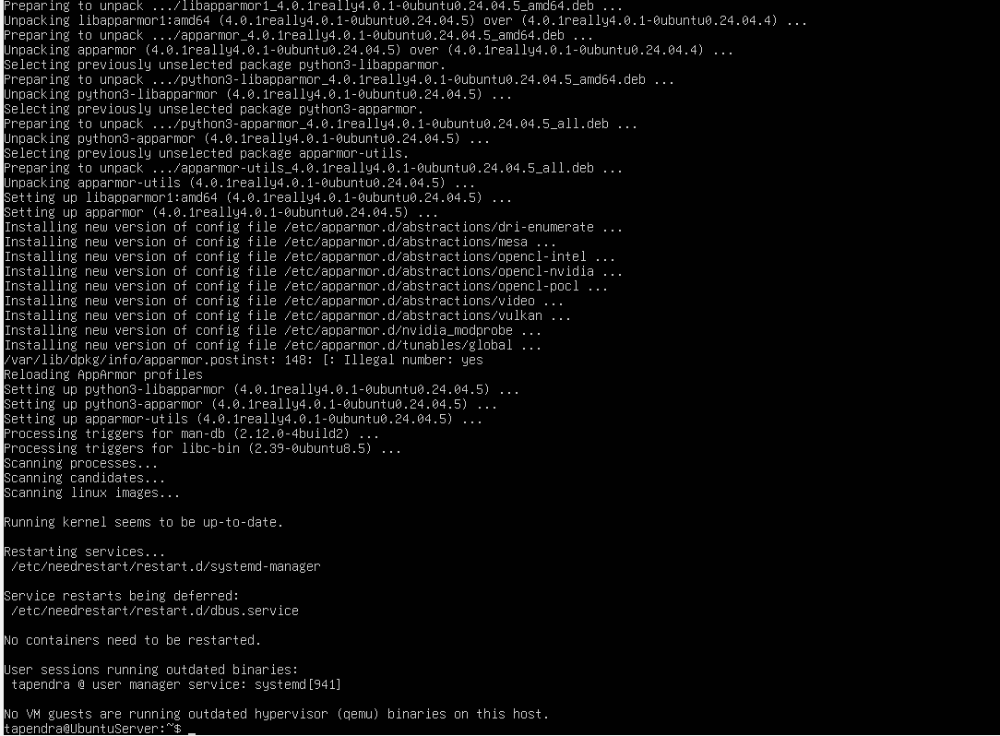
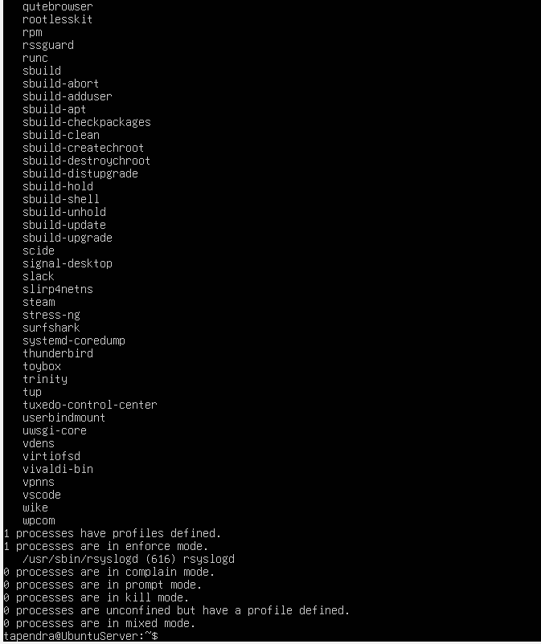
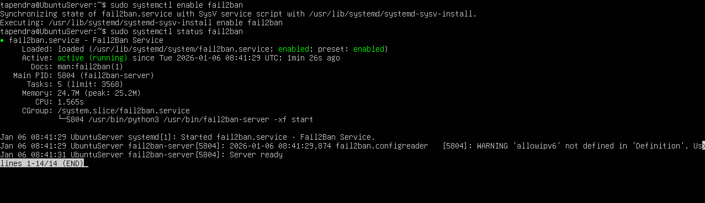
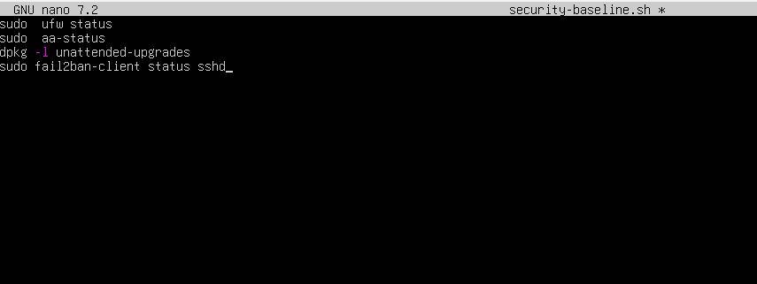
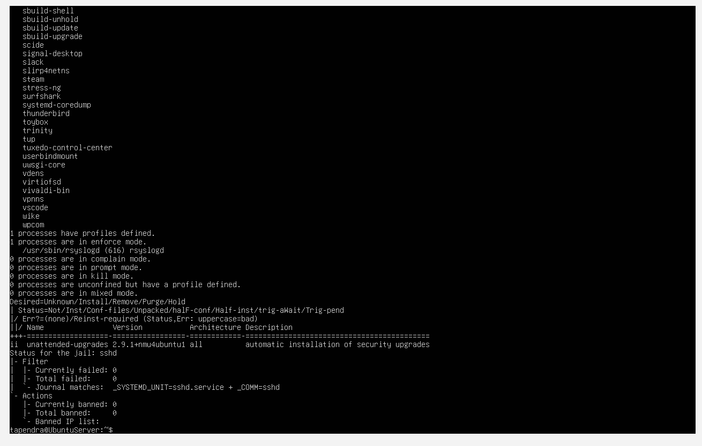
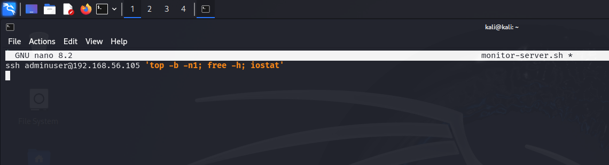
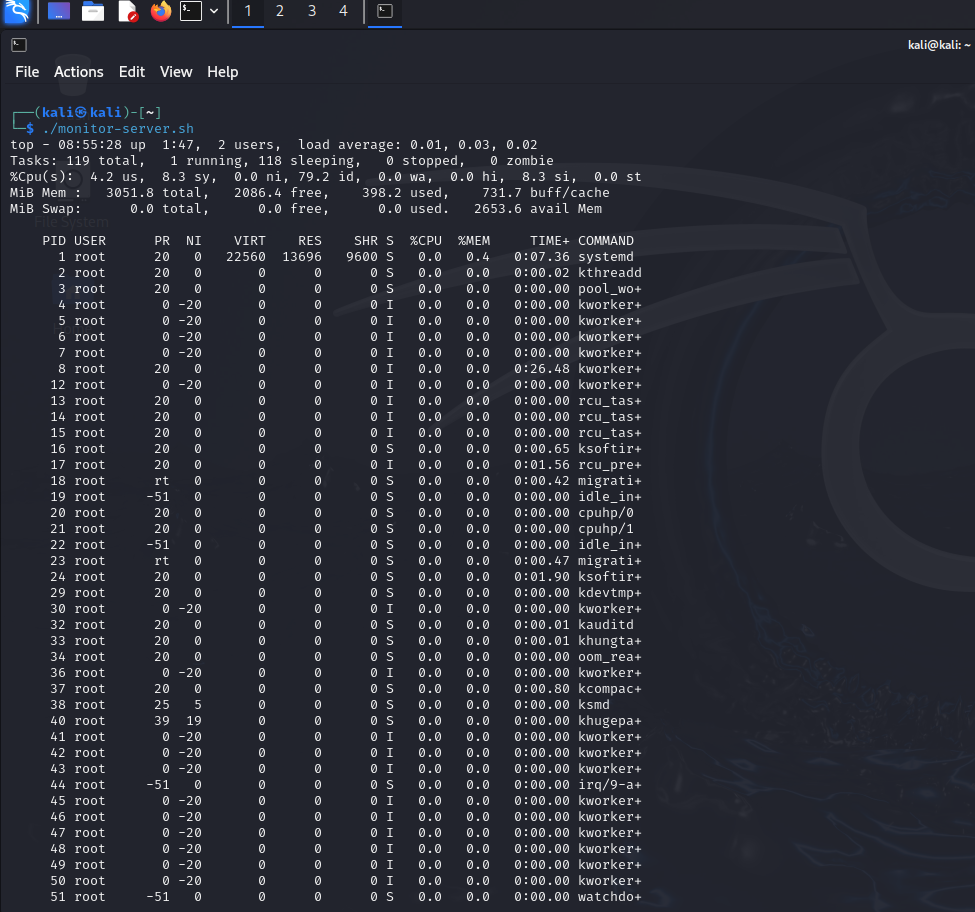
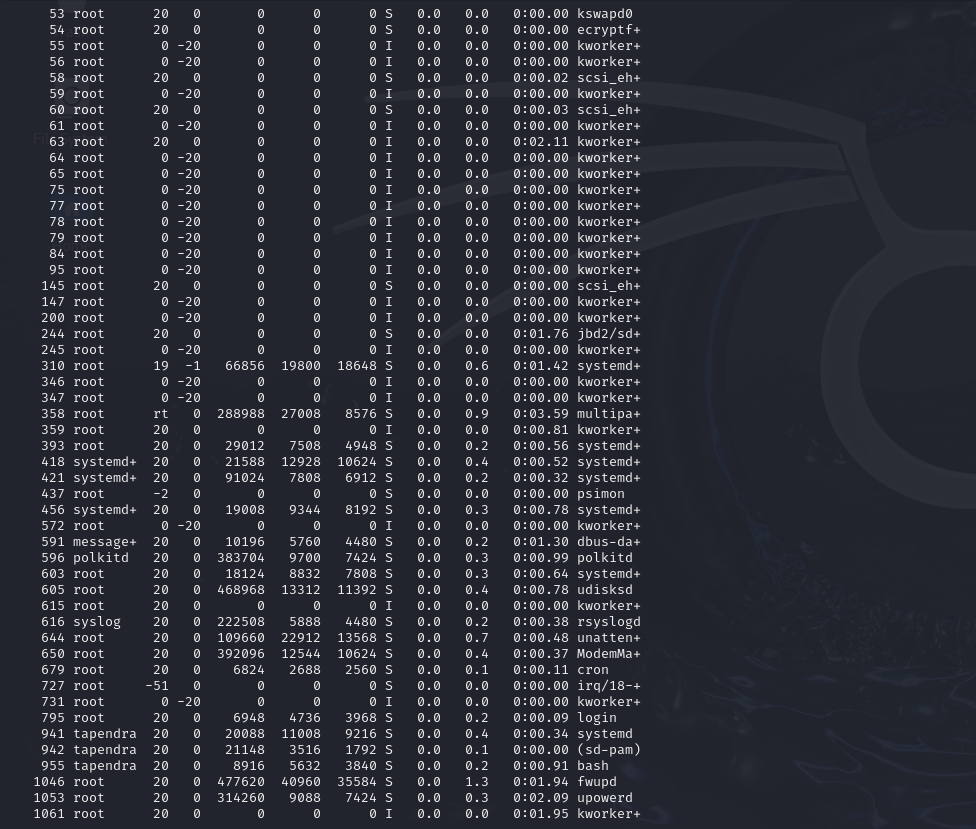
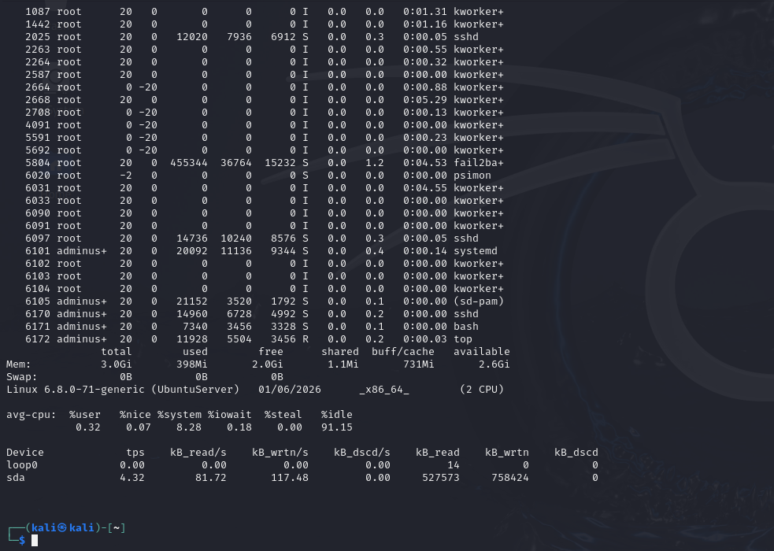

# Week 5: Advanced Security and Monitoring Infrastructure

## Implement Access Control (AppArmor)
Installed apparmor-utils, updated configs (new versions of abstractions like mesa, opencl). aa-status shows active profiles (e.g., 29 loaded, 25 in enforce mode).





## Configure Automatic Security Updates
Installed unattended-upgrades (already newest version 2.9.1), reconfigured to enable auto-updates.


## Configure fail2ban
Installed, enabled, and checked status (active, running since 08:41:29, memory 24.7M, server ready).



## security-baseline.sh (on Server)
Script code:
```bash
#!/bin/bash
# Verify firewall
sudo ufw status
# Verify AppArmor
sudo aa-status
# Verify updates
dpkg -l unattended-upgrades
# Verify fail2ban
sudo fail2ban-client status sshd

Made executable, ran to verify all configs (outputs show UFW active, AppArmor profiles, packages installed, fail2ban jails).





### monitor-server.sh (on Kali)
Script code:
```bash
ssh adminuser@192.168.56.105 'top -b -n1; free -h; iostat'

Made executable, ran to collect metrics (shows top CPU/mem, free, iostat disk stats).
Monitor Script Code


Monitor Execution






## Reflection: Advanced controls address LO3 (intrusion detection, MAC). Scripts demonstrate LO4 proficiency. Trade-off: Automation adds overhead (e.g., fail2ban 24.7M memory) but improves monitoring. Learned error handling in bash.