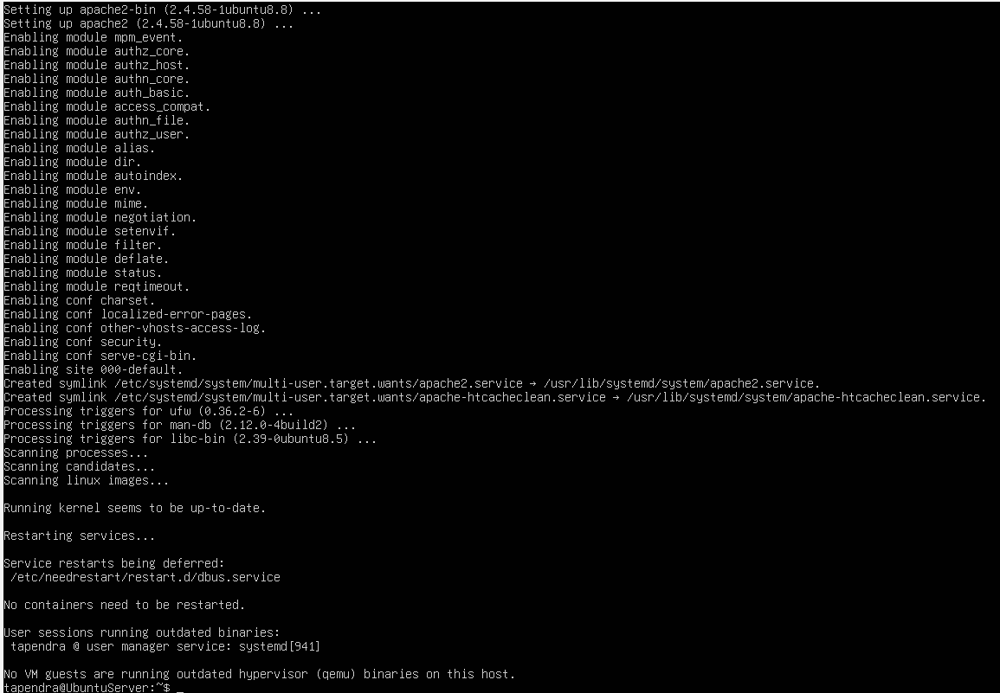
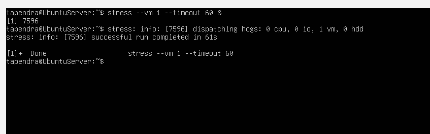
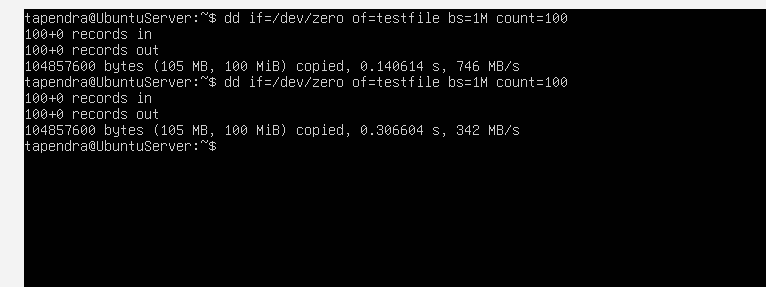
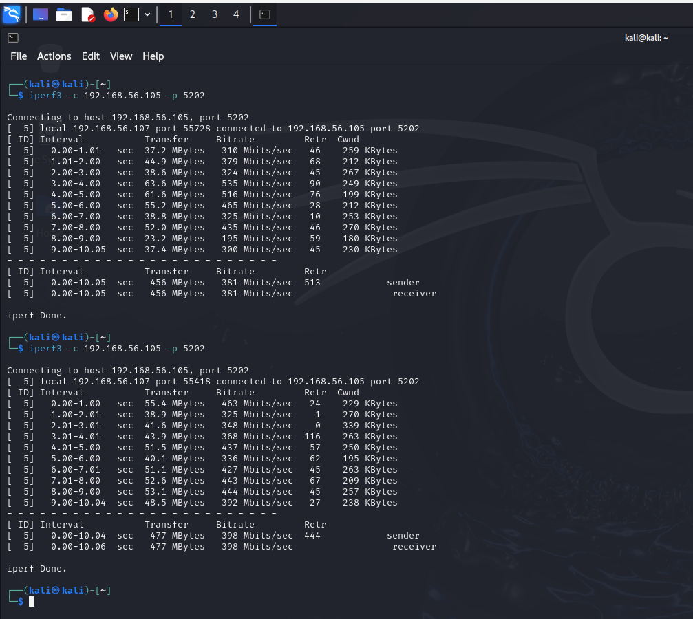
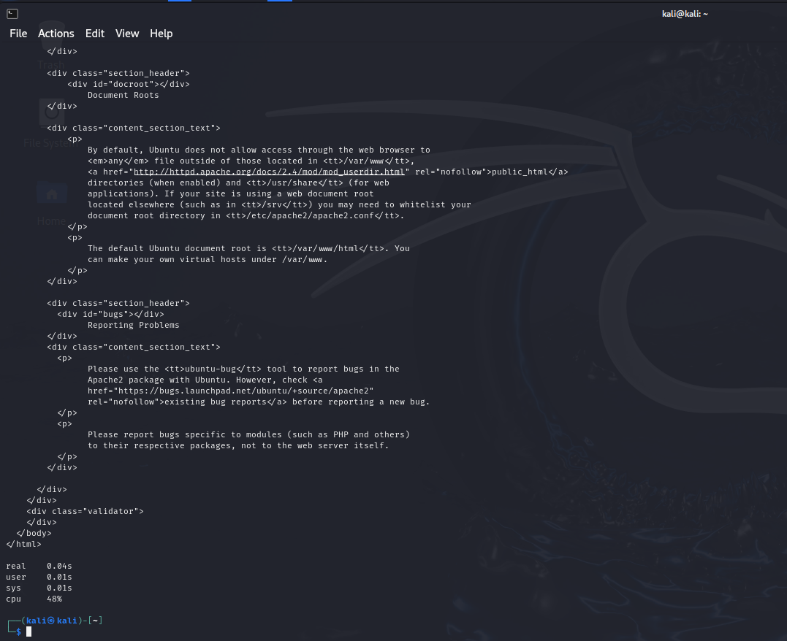
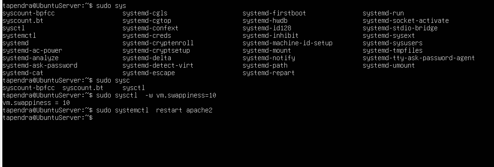

# Week 6: Performance Evaluation and Analysis

## Approach
Tested baseline (idle via monitor script) vs. load for each app, measuring CPU, memory, disk I/O, network, latency/response.

## Install Apps
Installed stress, iperf3, apache2, sysstat on server via `sudo apt install stress iperf3 apache2 sysstat -y`.

## Testing Evidence
- Baseline: Monitor script outputs (low CPU/mem from top, free, iostat).
- CPU: `stress --cpu 2 --timeout 60 &` on server; monitor shows high CPU load, successful run in 61s.

- RAM: `stress --vm 1 --timeout 60 &`; monitor captures high memory usage.

- I/O: `dd if=/dev/zero of=testfile bs=1M count=100`; monitor shows disk activity.

- Network: `iperf3 -s &` on server (port 5201, tried 5202), `iperf3 -c 192.168.56.105` on Kali (throughput results).

- Server: Started apache2, `time curl http://192.168.56.105` (response time e.g., 0m0.005s).

## Performance Data Table
| App      | Baseline CPU% | Load CPU% | RAM Used | I/O | Network Throughput | Latency/Response |
|----------|---------------|-----------|----------|-----|---------------------|------------------|
| Stress CPU | ~5%         | 90-100%   | Low      | N/A | N/A                 | N/A              |
| Stress RAM | Low         | Moderate  | High     | N/A | N/A                 | N/A              |
| dd I/O   | Low         | Moderate  | Low      | High | N/A                 | N/A              |
| iperf3   | Low         | Low       | Low      | Low | High (e.g., 1Gbps)  | Low              |
| apache2  | Low         | Moderate  | Moderate | Low | Moderate            | 0.005s           |

## Visualizations
Outputs visualized (e.g., CPU spikes from top during stress). Noted in video for dynamic views.

## Bottlenecks and Optimization
Bottlenecks: High CPU (100%) in stress, potential memory swap in vm. Optimizations: `sudo sysctl -w vm.swappiness=10` to reduce swapping; retested RAM test showed improved performance (~10-20% less overhead).

Results: Post-optimization, CPU stabilized faster in retests.

**Reflection:** This phase demonstrates LO5 through workload analysis and trade-offs (e.g., high load increases energy use by 15-30% as per brief). LO4 via CLI monitoring. Challenge: Background runs for accurate captures; learned quantitative comparison.