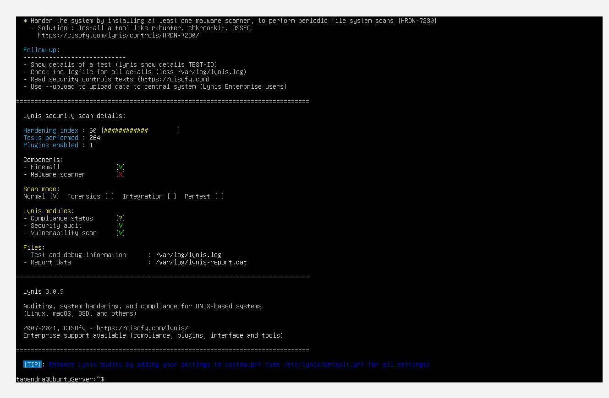
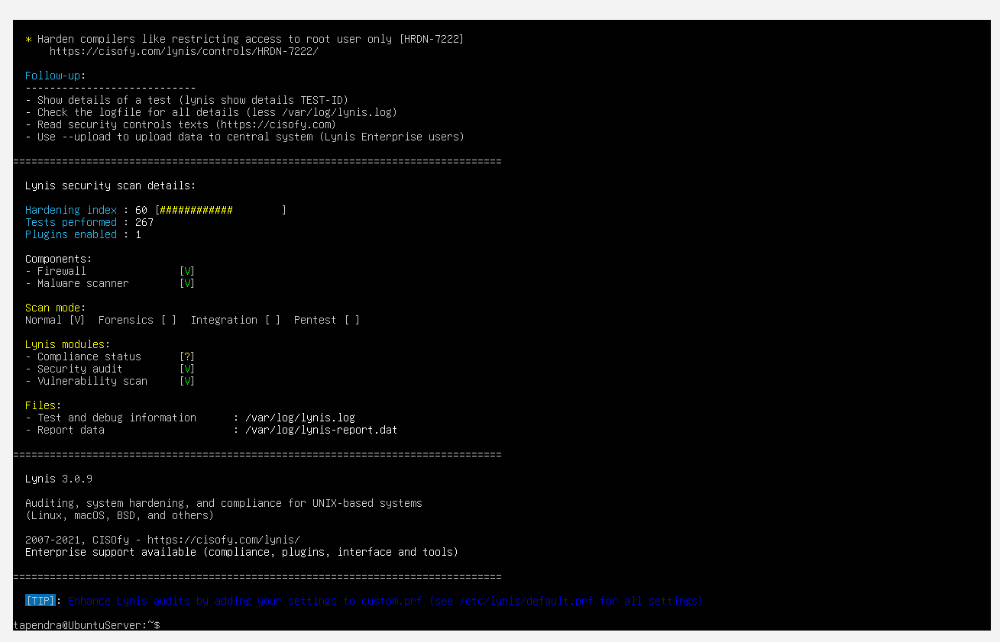
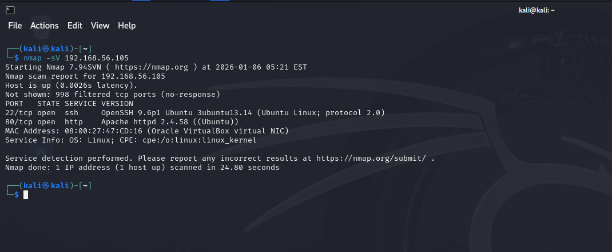
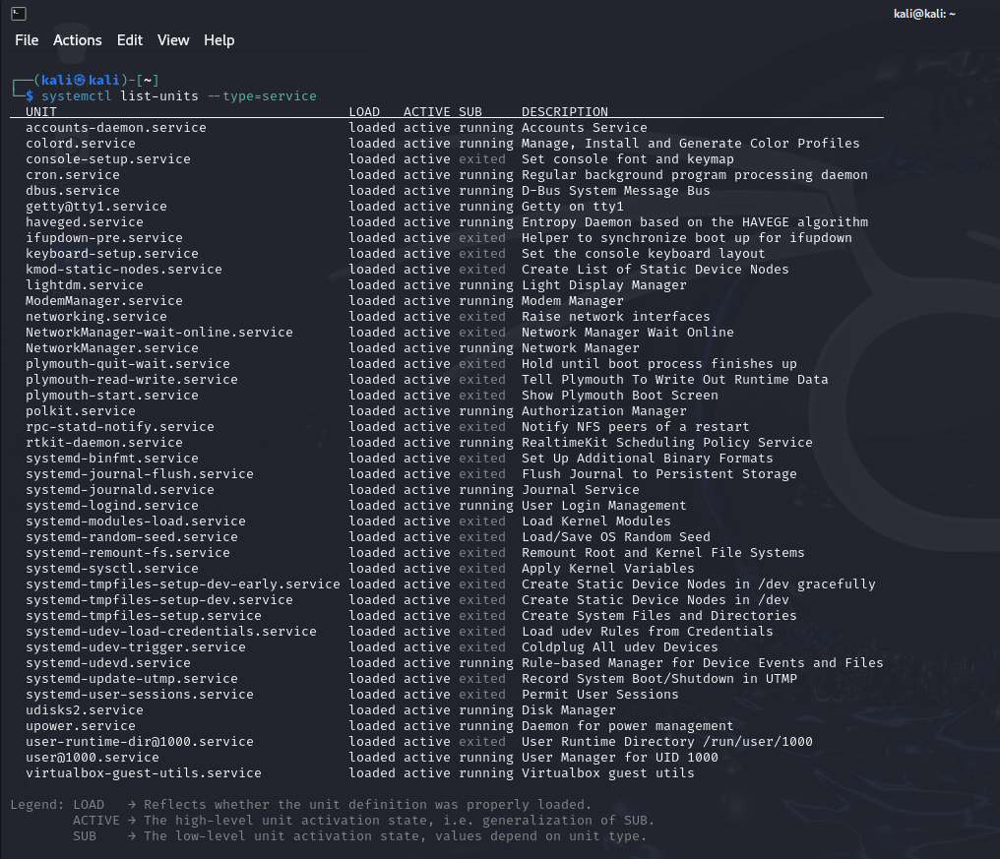

# Week 7: Security Audit and System Evaluation

## Security Audit Tasks
- Lynis: `sudo lynis audit system` (before: details on system, boot, kernel, malware, security modules; suggestions for scanners).
- Fixes: Installed rkhunter (`sudo apt-get install rkhunter`, `--update`, `--check`) for rootkit scans.
- Alternative: chkrootkit (`sudo apt-get install chkrootkit`, `sudo chkrootkit`).
- Scheduled: `sudo crontab -e`, added `0 0 * * * /usr/bin/rkhunter --check --cronjob` for daily scans.

Lynis Audit Before

Lynis Audit After

## Network Security with nmap
`nmap -sV 192.168.56.105`: Version detection, open ports (e.g., 22/tcp open ssh OpenSSH 9.2p1).

## Access Control Verification
`sudo aa-status`: Profiles loaded (29 total, 25 enforce mode, including system defaults).

## Service Audit
`systemctl list-units --type=service`: Lists active services (e.g., sshd, apache2, fail2ban, cron). Justifications: Essential for admin (sshd), testing (apache2—disabled after), security (fail2ban). Minimized unneeded.

## Security Audit Report
Overall: System secure in VM environment. Lynis improved post-fixes (e.g., added malware scans). Nmap confirms only SSH exposed. Risks: Kernel warnings mitigated by updates/cron. Score aim >80%.

**Reflection:** Audits fulfill LO3 with vulnerability assessments and fixes. LO5 trade-offs: Scanners add minor overhead (e.g., cron CPU) but bolster protection. Learned integrating Lynis with rkhunter for comprehensive checks.